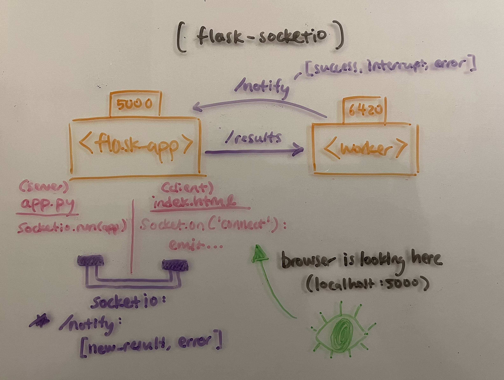

hewwo :3

# What am I looking at?
This is a learning project for backend stuff. (Tech stack below).

Premise is something like: 

1. user queues job through dashboard (generate playlist name based on input description)
2. task put in Redis queue
3. containerized worker picks up job
4. does the job (Ask ollama server (llama3.2) to generate playlist name)
5. writes to PostgreSQL db
6. displayed in dashboard!
wow!

## Quick Start with just Docker Compose
1. `docker compose up`
2. `docker exec -it ollama-server ollama pull llama3.2:latest`
    - or do this from Docker desktop
    - only need to do this once!
    - unless you delete the image :3
3. go to browser `localhost:5000`

# I need more details
no
(jk)

## Tech stack:
- Gunicorn
- Eventlet
- PostgreSQL
- Redis
- Docker
- Flask
    - Flask-WTF
    - Flask-SocketIO

## Other todo:
- [ ] make sure `worker` and `flask-app` containers don't start until `postgres` fully set up
- [ ] smaller images possible?
    - e.g., alpine linux instead of full python:3?
- [ ] use MCP, and maybe some Spotify API? to make actual playlists
- [ ] nginx reverse proxy?
- [ ] ansible, make, kubernetes?

## Architecture:

 - needed to add a Flask-SocketIO connection (`flask-app` to the user's browser)
    - otherwise, it's just a non-permanent browser session, and had issue with Flask.flash()
	- same issue with `return redirect(url_for('dashboard'))`, if it's triggered by `worker`