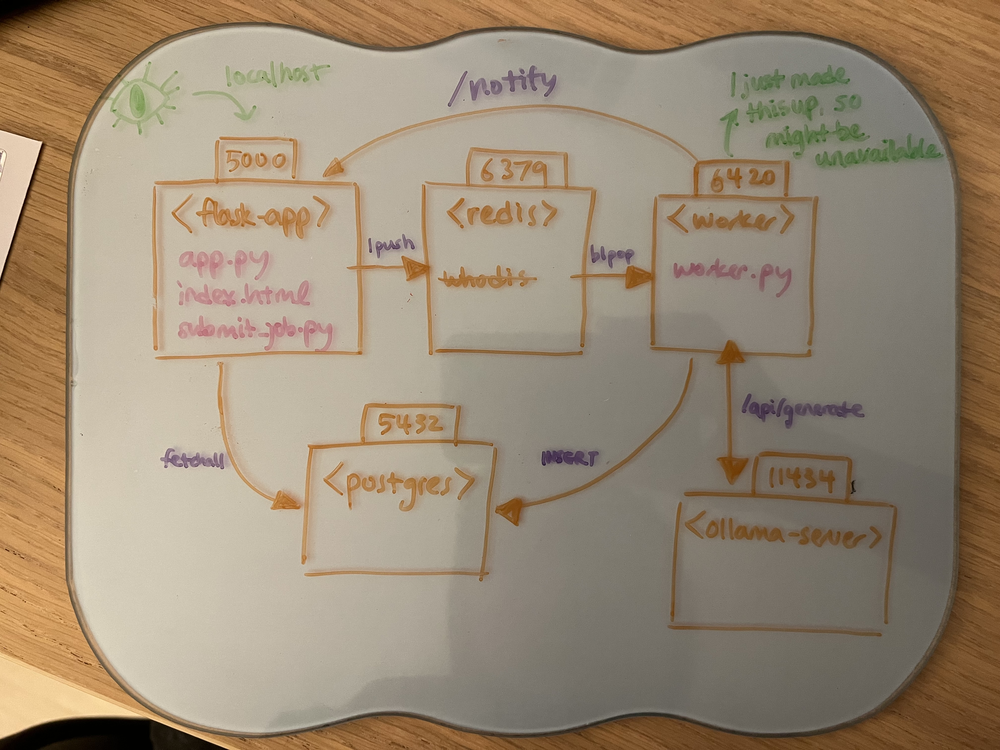
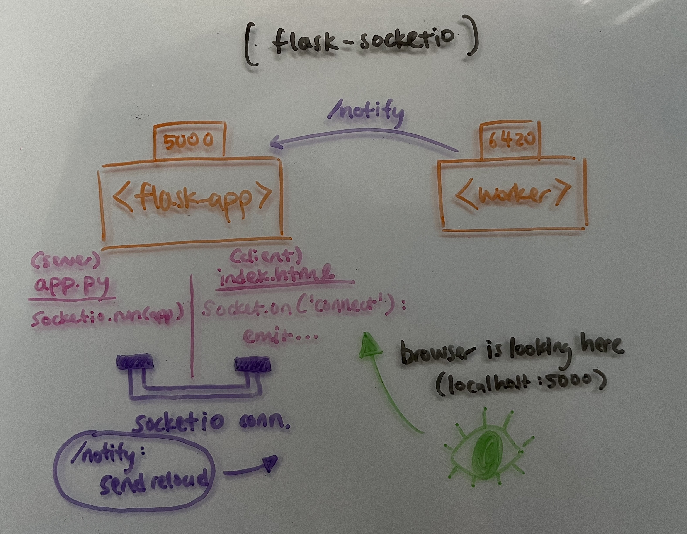

hewwo :3

## What am I looking at?
This is a learning project for backend stuff. (Tech stack below).

Premise is something like: 

- user queues job through dashboard (generate playlist name)
- task put in Redis
- containerized worker picks up job
- does the job
- writes to PostgreSQL db
- displayed in dashboard!
wow!

## I need more details
no
(jk)

Devlog and stuff are in your Obsidian repo.
Maybe I should clean it up and put it here?

## Tech stack:
- Gunicorn
- Eventlet
- PostgreSQL
- Redis
- Docker
- Flask
    - Flask-WTF
    - Flask-SocketIO

## Not yet tech stack:
- Ansible
- Make
- Kubernetes
- nginx

## Quick Start with just Docker Compose
1. `docker compose up`
2. `docker exec -it ollama-server ollama pull llama3.2:latest`
    - or do this from Docker desktop
    - only need to do this once!
    - unless you delete the image :3
3. go to browser `localhost:5000`

## Architecture:

